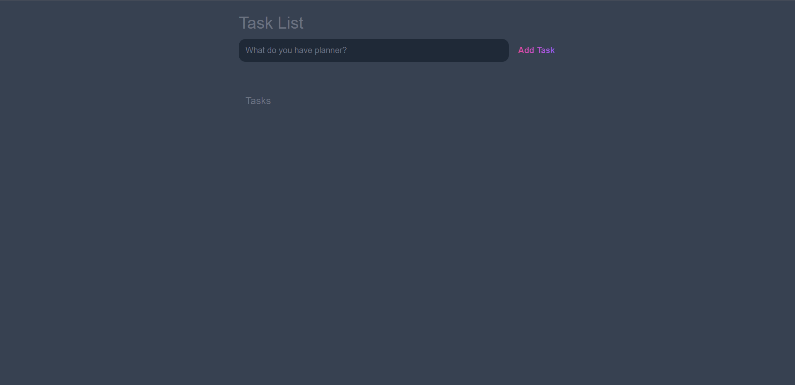

<h1 align="center">
   Lista de Tarefas
</h1>

<h1 align="center">
    
</h1>

<h3 align="center">Você pode acessar o projeto <a href="https://listadetarefas-beryl.vercel.app/" target="_blank">clicando aqui</a></h3>

---

</br>

# Sobre o projeto

**Lista de Tarefas(Task List)** é um projeto que fiz seguindo o tutorial do [Tyler Potts](https://www.youtube.com/c/TylerPotts)
</br>
</br>
"Esse é um dos projetos que estou desenvolvendo para me aperfeiçoar no **JavaScript** antes de começar a estudar **React**."

<br/>

# Tecnologias

- [Html](https://www.w3schools.com/html/)
- [Css](https://www.w3schools.com/css/)
- [JavaScript](https://developer.mozilla.org/en-US/docs/Web/JavaScript)

---

<br/>

## Como baixar o projeto:

```bash
# Clonar o repositório
$ git clone https://github.com/mateusarcedev/listadetarefas
# Entrar no diretório
$ cd listadetarefas
```

---

<p align="center"> Desenvolvido por <a href="https://www.linkedin.com/in/mateus-arce/">Mateus Arce</a>✌🏼</p>